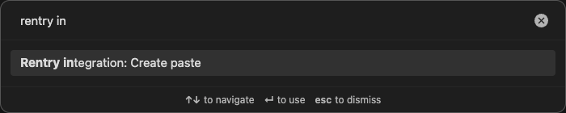
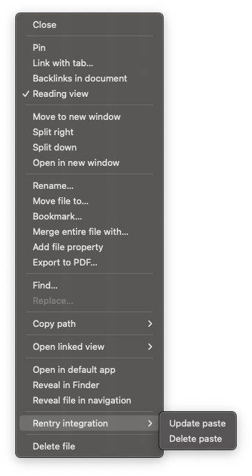

# Rentry integration

[Rentry](https://rentry.co) integration plugin for [Obsidian](https://obsidian.md).

https://github.com/user-attachments/assets/0f929724-8d32-4eda-aef1-c622cfc19cb6

## Features

- Paste creation.
- Paste updating (one-way sync towards rentry) and removal.
- Image embed uploads via cloudinary (_experimental_, requires credentials. See cloudinary's [Developer kickstart](https://cloudinary.com/documentation/dev_kickstart) for further instructions).

## Usage

Can either be used via the command palette (<kbd>Ctrl / ⌘</kbd> + <kbd>P</kbd>):



or the file context menu:



## Frontmatter properties

The following frontmatter properties are created and used by the plugin for all rentry (and cloudinary) related actions:

| Property           | Description                                                                                                                    |
| ------------------ | ------------------------------------------------------------------------------------------------------------------------------ |
| `rentryId`         | The rentry id of the uploaded paste.                                                                                           |
| `rentryUrl`        | The public rentry URL of the uploaded paste                                                                                    |
| `rentryEditCode`   | Edit code for directly editing the paste on the rentry website.                                                                |
| `rentryEmbedCache` | Cache for mapping embed paths to cloudinary URLs and other data. Only used when the "Enable embed uploads" setting is enabled. |

## Rentry metadata

While using [rentry metadata](https://rentry.co/metadata-how) is not supported by the plugin, the following default metadata is used when creating pastes:

```ini
OPTION_DISABLE_SEARCH_ENGINE=true
OPTION_DISABLE_VIEWS=true
```

Additionally, the plugin uses rentry's upsert update mode for metadata when updating the paste. This means that whatever changes to the metadata you make on rentry are going to persist between updates.
